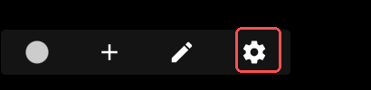
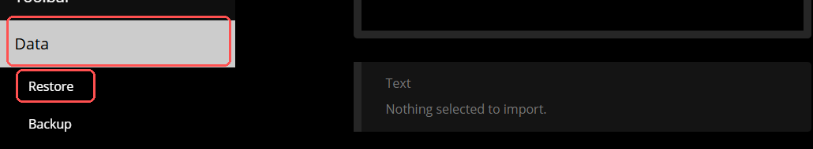
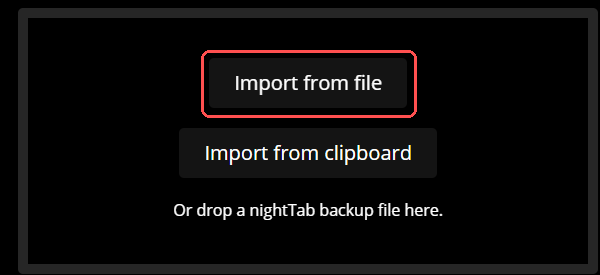
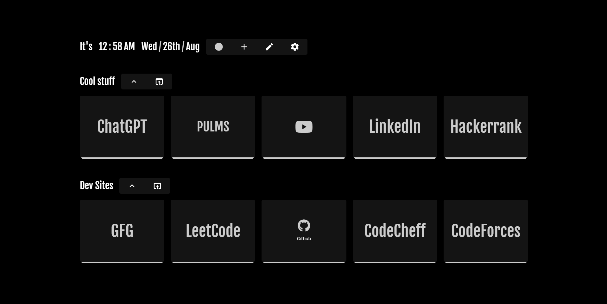

# 🧩 Browser Customizer

<p align="center">
  <strong>A ready-made browser new-tab setup with bookmarks, theme and layout.</strong>
  <br>
  Install the extension → download the setup → import it → done.
</p>

<p align="center">
  <a href="https://github.com/zombieFox/nightTab">
    
  </a>
</p>

<br>

---

## 🌐 1. Install the Extension

<p align="center">
  <strong>Choose your browser and install the extension first.</strong>
  <br>
  <sub>This is the first step. The setup cannot be imported until the extension is installed.</sub>
</p>

<br>

<table align="center">
<tr>

<td align="center" width="180">
<a href="https://chromewebstore.google.com/detail/nighttab/hdpcadigjkbcpnlcpbcohpafiaefanki">

</a>
<br>
<sub>Chrome</sub>
</td>

<td align="center" width="180">
<a href="https://chromewebstore.google.com/detail/nighttab/hdpcadigjkbcpnlcpbcohpafiaefanki">

</a>
<br>
<sub>Edge</sub>
</td>

<td align="center" width="180">
<a href="https://chromewebstore.google.com/detail/nighttab/hdpcadigjkbcpnlcpbcohpafiaefanki">

</a>
<br>
<sub>Brave</sub>
</td>

<td align="center" width="180">
<a href="https://addons.mozilla.org/en-US/firefox/addon/nighttab/">

</a>
<br>
<sub>Firefox</sub>
</td>

</tr>
</table>

<br>

<p align="center">
  <sub>
    Chrome, Edge and Brave use the Chromium extension listing.
    Firefox uses the official Mozilla Add-ons listing.
  </sub>
</p>

<br>

---

## ⬇️ 2. Download the Setup

<p align="center">
  <strong>Download the ready-made browser configuration.</strong>
  <br>
  <sub>You will import this file in Step 5.</sub>
</p>

<br>

<p align="center">
  <a href="https://github.com/oxanuragofficial/nighttab-setup-guide-final2/releases/latest/download/nighttab-backup.json">
    
  </a>
</p>

<br>

<p align="center">
  <strong>File:</strong> <code>nighttab-backup.json</code>
</p>

<p align="center">
  <sub>
    Save the downloaded file somewhere easy to find.
    Do not edit the file.
  </sub>
</p>

<br>

---

# 🚀 Setup Guide

<p align="center">
  Follow the steps below in order.
</p>

<br>

## 3️⃣ Open a New Tab

After installing the extension:

1. Open your browser.
2. Open a **new tab**.
3. The customized new-tab page will appear.
4. Move your cursor toward the bottom of the page to reveal the footer controls.
5. Click the **⚙️ Settings** button.

<p align="center">
  
</p>

<p align="center">
  <strong>Look for the ⚙️ Settings button shown in the image above.</strong>
</p>

<br>

---

## 4️⃣ Open Data → Restore

After opening Settings:

1. Find **Data** in the Settings menu.
2. Click **Data**.
3. Select **Restore**.
4. The Restore page will open.

<p align="center">
  
</p>

<p align="center">
  <strong>Open Data and then select Restore.</strong>
</p>

<br>

---

## 5️⃣ Import the Downloaded File

On the Restore page:

1. Click **Import from file**.
2. Your browser's file picker will open.
3. Find the file downloaded in Step 2.
4. Select:

```text
nighttab-backup.json
```

<p align="center">
  
</p>

<p align="center">
  <strong>Click "Import from file" and select <code>nighttab-backup.json</code>.</strong>
</p>

<br>

> **Important:** Use the `nighttab-backup.json` file downloaded from this repository.

<br>

---

## 6️⃣ Finish the Setup

After selecting the backup:

1. Wait for the import to complete.
2. If nightTab asks for confirmation, confirm the import.
3. Return to the new-tab page.
4. Your saved setup should now be visible.

<p align="center">
  
</p>

<p align="center">
  <strong>🎉 Your browser setup is ready.</strong>
</p>

<br>

---

# ✨ What's Included

<p align="center">
  <strong>The imported setup includes:</strong>
</p>

<br>

<div align="center">

| Feature | Included |
|:---|:---:|
| 🕐 Clock & Date | ✅ |
| 🔖 Bookmark Groups | ✅ |
| 🎨 Custom Theme | ✅ |
| 📐 Custom Layout | ✅ |
| 🔗 Developer Websites | ✅ |
| 📚 Useful Websites | ✅ |
| 💾 Importable Backup | ✅ |

</div>

<br>

### 🔖 Bookmark Groups

<p align="center">
  <strong>Cool Stuff</strong>
  <br>
  ChatGPT • PULMS • YouTube • LinkedIn • HackerRank
</p>

<p align="center">
  <strong>Dev Sites</strong>
  <br>
  GeeksforGeeks • LeetCode • GitHub • CodeChef • Codeforces
</p>

<br>

---

# 🔄 Setup Flow

<p align="center">

```text
🌐 Install Extension
        ↓
⬇️ Download Setup
        ↓
🆕 Open New Tab
        ↓
⚙️ Open Settings
        ↓
📦 Data → Restore
        ↓
📂 Import nighttab-backup.json
        ↓
🎉 Done
```

</p>

<br>

---

# 📥 Download the Setup

<p align="center">
  <strong>Need the setup file again?</strong>
</p>

<br>

<p align="center">
  <a href="https://github.com/oxanuragofficial/nighttab-setup-guide-final2/releases/latest/download/nighttab-backup.json">
    
  </a>
</p>

<br>

<p align="center">
  <a href="https://github.com/oxanuragofficial/nighttab-setup-guide-final2/releases/latest">
    
  </a>
</p>

<br>

---

# 🔗 Official Resources

<table align="center">
<tr>

<td align="center" width="220">
<a href="https://chromewebstore.google.com/detail/nighttab/hdpcadigjkbcpnlcpbcohpafiaefanki">

</a>
</td>

<td align="center" width="220">
<a href="https://addons.mozilla.org/en-US/firefox/addon/nighttab/">

</a>
</td>

<td align="center" width="220">
<a href="https://github.com/zombieFox/nightTab">

</a>
</td>

</tr>
</table>

<br>

---

# 📁 Project Structure

```text
browser-customizer/
│
├── README.md
│
├── backup/
│   └── nighttab-backup.json
│
├── docs/
│   └── images/
│       ├── 01-new-tab-settings.png
│       ├── 02-data-restore.png
│       ├── 03-import-file.png
│       └── 04-result.png
│
├── LICENSE
├── CONTRIBUTING.md
└── SECURITY.md
```

<br>

---

<p align="center">
  <strong>🧩 Browser Customizer</strong>
  <br>
  <sub>Install. Import. Customize your new tab.</sub>
</p>

<br>

<p align="center">
  <a href="https://github.com/oxanuragofficial/nighttab-setup-guide-final2">
    
  </a>
</p>
